# Collaborative GNSS Meaconing Detection via UWB Ranging and CUSUM

**Master's Thesis (TFM)** — Security Architecture for Autonomous Robot Navigation  
Antonio García Alcón — Universidad Europea de Madrid, 2026

---

## Overview

This project implements a **collaborative meaconing detection system** for multi-robot GNSS navigation. A *meaconing attack* consists of receiving legitimate GNSS signals, delaying them, and rebroadcasting them — causing all victim receivers in range to report the same fake position. The attack is particularly dangerous for autonomous vehicle fleets because it is undetectable by any single receiver.

<p align="center">
  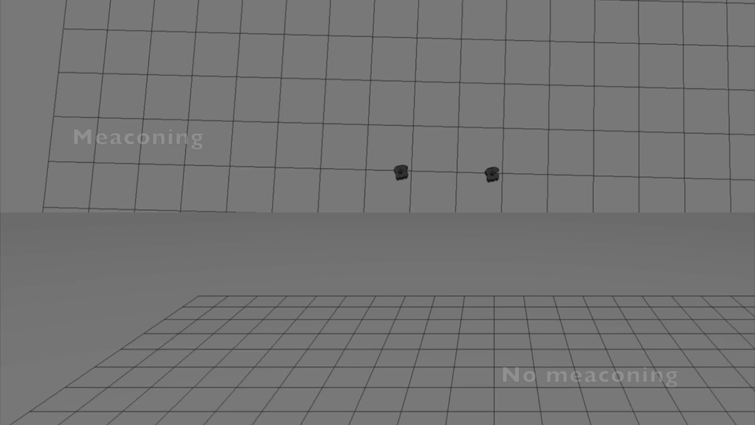
</p>

**Meaconing versus normal navigation.** The comparison shows how the GNSS manipulation changes the reported navigation state while the physical robots continue moving. This visual motivates the collaborative consistency check between GNSS and UWB used by the detector.

The detection strategy is based on a simple insight:

> **Compare two independent measurements of the same physical quantity — the inter-robot distance.**

| Source | Measurement | Vulnerable to meaconing? |
|---|---|---|
| GNSS positions | $D_{GNSS} = \|\vec{p}_A - \vec{p}_B\|$ | ✅ Yes — both meaconed to same point → $D_{GNSS} \approx 0$ |
| UWB ranging | $D_{UWB}$ (physical radio distance) | ❌ No — measures true Euclidean distance |

Under normal operation $D_{GNSS} \approx D_{UWB}$ (within sensor noise). Under a meaconing attack, $D_{GNSS}$ collapses to near-zero while $D_{UWB}$ remains at the true physical distance, creating a **persistent positive bias** in $\delta = D_{UWB} - D_{GNSS}$.

A **CUSUM** (Cumulative Sum) sequential detector accumulates this bias and triggers an alarm when the statistic crosses a threshold:

$$S_k = \max(0, S_{k-1} + \delta_k - \beta), \qquad \text{alarm if } S_k > \tau$$

The CUSUM is superior to a fixed threshold because it **accumulates evidence over time** rather than reacting to single-sample noise. To reject brief noise transients, the alarm only fires after $S_k$ has stayed above $\tau$ for a **confirmation window** (`alert_confirm_time` = 2 s by default), so a genuine detection is reported ~2 s after the statistic first crosses the threshold.

### Key references

- Bhatti & Humphreys (2017). *Hostile Control of Ships via False GPS Signals.*
- Chen et al. (2022). *A Survey of Robot Swarms' Relative Localization Method.* Sensors (MDPI), 22(11), 4212.
- Fishberg et al. (2024). *MURP: Multi-Agent Ultra-Wideband Relative Pose Estimation.*

---

## Meaconing detection Demo

<p align="center">
  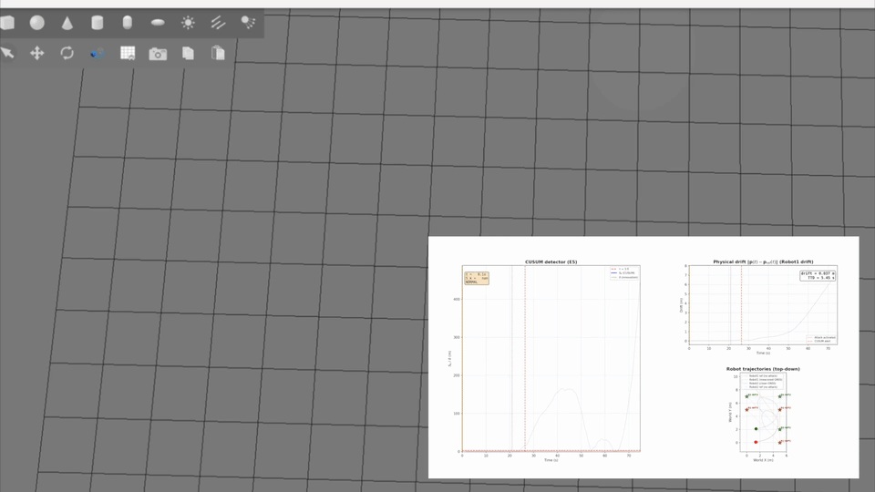
</p>

**Waypoint-follower under meaconing attack.** Robot1 (red trajectory) navigates toward a waypoint using GNSS-meaconed position; robot2 (green) uses clean odometry. When the attack activates (purple line), robot1's controller steers it off course while the CUSUM detector accumulates evidence. Three synchronized panels: (1) CUSUM S_k + innovation δ, (2) physical drift ‖p(t) − p_ref(t)‖, (3) top-down robot trajectories.

---

## Project Structure

```
tfm_meaconing_ws/                         # ROS 2 workspace root
├── README.md                             # ← this file
├── EXPERIMENTS.md                        # Detailed experiment guide
│
├── src/collaborative_detection/          # Source package
│   ├── package.xml                       # ROS 2 package manifest
│   ├── setup.py                          # Python entry points
│   ├── setup.cfg
│   │
│   ├── config/
│   │   └── params.yaml                   # All tunable parameters (noise, CUSUM, attack)
│   │
│   ├── resource/
│   │   └── collaborative_detection       # ROS 2 package marker (required by ament)
│   │
│   ├── launch/
│   │   ├── experiment.launch.py          # Full pipeline: Gazebo + sensors + CUSUM
│   │   └── two_robots.launch.py          # Two TurtleBot3 robots in Gazebo Sim
│   │
│   ├── scripts/
│   │   └── run_experiment.sh             # Run ONE experiment at a time (E0–E6)
│   │
│   ├── analysis/
│   │   ├── plot_results.py              # Generate detection metrics and plots from rosbags
│   │   └── make_video.py                # Generate E5 experiment video (3-panel animation)
│   │
│   └── collaborative_detection/          # Python package
│       ├── __init__.py
│       └── nodes/
│           ├── gnss_sim_node.py           # GNSS simulator (odometry → noisy GNSS)
│           ├── uwb_sim_node.py            # UWB ranging simulator (odometry → distance)
│           ├── meaconing_injector.py      # Attack injector (meacons GNSS positions (signal retard + rebroadcast))
│           ├── cusum_detector_node.py     # CUSUM sequential detector
│           ├── robot_mover_node.py        # Autonomous circular motion controller
│           ├── waypoint_follower_node.py  # E5: GNSS-meaconed waypoint navigation
│           └── gnss_viz_node.py           # RViz2 Marker visualizer
│
├── build/                                # Colcon build artifacts (auto-generated)
├── install/                              # Colcon install artifacts (auto-generated)
├── log/                                  # Build logs (auto-generated)
└── results/                              # Experiment rosbags + params snapshots
    ├── E0_baseline/
    ├── E1_slow_drift/
    ├── E2_fast_drift/
    ├── E3_hot_start/
    ├── E4_wide_separation/
    ├── e5_ref_waypoint_reference/
    ├── e5_waypoint_attack/
    └── e6_dual_meaconing/
```

---

## System Architecture

```
┌─────────────────────────────────────────────────────────────────────┐
│                        GAZEBO SIM                                   │
│  ┌──────────┐                     ┌──────────┐                      │
│  │ Robot1   │──── UWB ranging ────│ Robot2   │   Physical layer     │
│  │ (x₁,y₁)  │    (D_UWB ≈ 3m)     │ (x₂,y₂)  │                      │
│  └────┬─────┘                     └────┬─────┘                      │
│       │ odom                            │ odom                      │
└───────┼─────────────────────────────────┼───────────────────────────┘
        │                                 │
        ▼                                 ▼
┌──────────────┐                  ┌──────────────┐
│ GNSS Sim     │                  │ UWB Sim      │   Sensor layer
│ + noise      │                  │ + noise      │
│ (world frame)│                  │ (world frame)│
└──────┬───────┘                  └──────┬───────┘
       │ gnss_clean                      │ uwb_distance
       ▼                                 │
┌──────────────┐                         │
│ Meaconing    │  ── gnss_spoofed ──┐    │   Attack layer
│ Injector     │                    │    │
│ (passthrough │                    │    │
│  or meacon)  │                    │    │
└──────────────┘                    │    │
                                    ▼    ▼
                            ┌──────────────────┐
                            │ CUSUM Detector   │   Detection layer
                            │ δ = D_UWB−D_GNSS │
                            │ S_k = max(0, ...)│
                            └────────┬─────────┘
                                     │ /system/meaconing_alert
                                     ▼
                                 🚨 ALARM
```

### Data Flow

1. **Gazebo Sim** runs two TurtleBot3 Waffle robots moving in autonomous circles.
2. **GNSS Sim Node** reads odometry from both robots, converts from local `odom` frame to global `world` frame using spawn offsets, adds Gaussian noise, and publishes `gnss_clean` at 30 Hz.
3. **UWB Sim Node** reads odometry from both robots, converts to world frame, computes the Euclidean distance, adds Gaussian noise (σ = 0.24 m), and publishes `uwb_distance` at 30 Hz.
4. **Meaconing Injector** subscribes to `gnss_clean` and, when inactive, passes it through as `gnss_spoofed`. When the attack activates (auto-delay or manual service call), both robots' GNSS outputs are **gradually dragged toward a common fake target at `drift_velocity`** plus independent noise — a single-antenna 'drag-off' meaconing attack. Slower drift collapses `D_GNSS` more slowly, so the CUSUM rises at a rate proportional to `drift_velocity`.
5. **CUSUM Detector** subscribes to `gnss_spoofed` (both robots) and `uwb_distance`, computes $D_{GNSS}$ and $\delta$, updates the CUSUM statistic, and publishes an alert once $S_k$ has stayed above $\tau$ for the `alert_confirm_time` confirmation window (2 s).

### Topics

| Topic | Type | Description |
|---|---|---|
| `/robot1/gnss_clean` | `PoseStamped` | Simulated GNSS position (world frame, with noise) |
| `/robot2/gnss_clean` | `PoseStamped` | Simulated GNSS position (world frame, with noise) |
| `/robot1/gnss_spoofed` | `PoseStamped` | GNSS position after meaconing injector (clean or meaconed) |
| `/robot2/gnss_spoofed` | `PoseStamped` | GNSS position after meaconing injector (clean or meaconed) |
| `/robots/uwb_distance` | `Float64` | Simulated UWB range between robots (m) |
| `/system/cusum_value` | `Float64` | Current CUSUM statistic (max of both tails) |
| `/system/cusum_plus` | `Float64` | Positive-tail accumulator $S^+_k$ (D_GNSS collapse) |
| `/system/cusum_minus` | `Float64` | Negative-tail accumulator $S^-_k$ (D_GNSS inflation) |
| `/system/delta_value` | `Float64` | Baseline-corrected, filtered innovation used by CUSUM |
| `/system/delta_raw` | `Float64` | Raw innovation before startup baseline correction |
| `/system/meaconing_alert` | `Bool` | Detection alarm (`true` = meaconing detected) |
| `/meaconing/active` | `Bool` | Attack active status |
| `/meaconing/activation_event` | `Float64` | One-shot activation marker used for precise TTD measurement |
| `/robot1/cmd_vel` | `TwistStamped` | Velocity command for robot 1 |
| `/robot2/cmd_vel` | `TwistStamped` | Velocity command for robot 2 |

### Services

| Service | Type | Description |
|---|---|---|
| `/meaconing/set_active` | `SetBool` | Manually activate/deactivate the attack |
| `/system/reset_cusum` | `Trigger` | Reset CUSUM accumulator to zero |

---

## Prerequisites

- **macOS** (tested on Apple Silicon) or **Linux**
- **RoboStack** with ROS 2 Jazzy (via pixi)
- **Gazebo Sim** (Harmonic or Ionic, installed outside pixi)
- Python 3.12+

---

## Linux Setup Without Pixi (Native ROS 2 Jazzy)

If you prefer not to use **pixi**, you can install ROS 2 Jazzy and Gazebo Sim natively on Ubuntu 24.04 (Noble) or other compatible Linux distributions.

### 1. Install ROS 2 Jazzy

```bash
# Add ROS 2 apt repository
sudo apt update && sudo apt install -y software-properties-common curl
sudo curl -sSL https://raw.githubusercontent.com/ros/rosdistro/master/ros.key -o /usr/share/keyrings/ros-archive-keyring.gpg
echo "deb [arch=$(dpkg --print-architecture) signed-by=/usr/share/keyrings/ros-archive-keyring.gpg] http://packages.ros.org/ros2/ubuntu $(. /etc/os-release && echo $UBUNTU_CODENAME) main" | sudo tee /etc/apt/sources.list.d/ros2.list > /dev/null

# Install ROS 2 Jazzy desktop (includes rviz2, rosbag2, etc.)
sudo apt update && sudo apt install -y ros-jazzy-desktop

# Install additional packages used by this project
sudo apt install -y \
  ros-jazzy-ros-gz-sim \
  ros-jazzy-turtlebot3 \
  ros-jazzy-turtlebot3-simulations \
  ros-jazzy-gazebo-ros-pkgs \
  python3-colcon-common-extensions \
  python3-rosdep \
  python3-pip
```

### 2. Install Gazebo Sim (Harmonic)

ROS 2 Jazzy pairs with **Gazebo Harmonic**. The `ros-jazzy-ros-gz-sim` package above provides the ROS-Gazebo bridge. For the Gazebo simulator itself:

```bash
# Add Gazebo repository
sudo apt update && sudo apt install -y lsb-release wget gnupg
sudo wget https://packages.osrfoundation.org/gazebo.gpg -O /usr/share/keyrings/pkgs-osrf-archive-keyring.gpg
echo "deb [arch=$(dpkg --print-architecture) signed-by=/usr/share/keyrings/pkgs-osrf-archive-keyring.gpg] http://packages.osrfoundation.org/gazebo/ubuntu-stable $(lsb_release -cs) main" | sudo tee /etc/apt/sources.list.d/gazebo-stable.list > /dev/null

# Install Gazebo Harmonic
sudo apt update && sudo apt install -y gz-harmonic
```

### 3. Initialize rosdep and install Python dependencies

```bash
# Initialize rosdep
sudo rosdep init
rosdep update

# Install Python dependencies (numpy, matplotlib, etc. for analysis)
pip3 install --user numpy matplotlib scipy
# Or install system-wide:
# sudo apt install -y python3-numpy python3-matplotlib python3-scipy
```

### 4. Source ROS 2 environment

Add to your `~/.bashrc` (or run manually each session):

```bash
echo "source /opt/ros/jazzy/setup.bash" >> ~/.bashrc
source ~/.bashrc
```

### 5. Build the workspace

```bash
cd ~/tfm_meaconing_ws
colcon build --packages-select collaborative_detection
source install/setup.bash
```

> **Note**: After building, you must source `install/setup.bash` in every new terminal (or add it to `~/.bashrc` after the ROS 2 source line).

---

## Setup & Build (Using Pixi)

### 1. Activate the RoboStack environment

```bash
cd ~/robostack
pixi run -e jazzy
```

### 2. Build the workspace

```bash
cd ~/tfm_meaconing_ws
colcon build --packages-select collaborative_detection
source install/setup.bash
```

### 3. Launch the full experiment

```bash
export TURTLEBOT3_MODEL=waffle
ros2 launch collaborative_detection experiment.launch.py
```

This starts **everything** in sequence:

| t (s) | Event |
|---|---|
| 0 | Gazebo Sim server + GUI |
| 2–3 | Two TurtleBot3 robots spawn at (0,0) and (3,0) |
| 5 | GNSS + UWB simulators start publishing |
| 5.5 | Meaconing injector starts (passthrough mode) |
| 6 | CUSUM detector starts (10 s warmup from first data sample) |
| 7 | Robots begin autonomous circular motion |
| 7.5 | GNSS visualization node starts (markers viewable in RViz2) |
| **30** | 🛑 Attack auto-activates (configurable) |

### 4. Verify the pipeline

In a second terminal (with `install/setup.bash` sourced):

```bash
# Check that sensors are publishing
ros2 topic echo /robots/uwb_distance    # Should show ~3 m
ros2 topic echo /system/cusum_value     # Should stay near 0 before attack

# Manually activate the attack (skip the 30 s wait)
ros2 service call /meaconing/set_active std_srvs/srv/SetBool "{data: true}"

# Watch the CUSUM statistic grow and trigger the alarm
ros2 topic echo /system/cusum_value
ros2 topic echo /system/meaconing_alert   # Should become true
```

---

## Experiments (E0–E6)

The script `scripts/run_experiment.sh` runs **one experiment at a time** (run them one-by-one so Gazebo and node processes never accumulate). It starts the recorder before the launch, so new bags include a short pre-roll of the startup sequence.

| Experiment | Command | Parameter | Description |
|---|---|---|---|
| **E0 — Baseline** | `run_experiment.sh e0` | `activation_delay: 9999.0` | No attack — validates **zero false positives** |
| **E1 — Slow drift** | `run_experiment.sh e1` | `drift_velocity: 0.1` | Subtle attack, measures detection sensitivity |
| **E2 — Fast drift** | `run_experiment.sh e2` | `drift_velocity: 0.5` | Obvious attack, measures minimum TTD |
| **E3 — Hot start** | `run_experiment.sh e3` | `activation_delay: 2.0` | Attack active from the beginning |
| **E4 — Wide separation** | `run_experiment.sh e4` | `x2: 5.0` | Robots 5 m apart — tests distance effect on TTD |
| **E5 — Waypoint attack** | `run_experiment.sh e5` | `waypoint_mode: true` | Robot1 navigates via GNSS-meaconed position — measures **physical drift** before detection |
| **E6 — Dual meaconing** | `run_experiment.sh e6` | `r2_gnss_source: spoofed` | Both robots navigate via GNSS-meaconed positions |

### Running an experiment

```bash
cd ~/tfm_meaconing_ws
source install/setup.bash
export TURTLEBOT3_MODEL=waffle
./src/collaborative_detection/scripts/run_experiment.sh e1
```

Each run lasts **90 seconds** by default (override with `--duration N`) and records a
rosbag in `results/e<X>_<name>/`. The script automatically:

1. Kills any leftover processes from previous runs (clean slate)
2. Modifies `params.yaml` for the experiment
3. Rebuilds the package and verifies the params reached the install tree
4. Starts rosbag2 before launching Gazebo to preserve a short startup pre-roll
5. Launches Gazebo **headless** (no GUI) + all nodes — pass `--gui` to keep the GUI
6. Records a rosbag with all relevant topics, including `/meaconing/activation_event`
7. Tears down every node/Gazebo/bridge process so nothing lingers

> **Tip**: run one experiment, check the rosbag, then run the next. Headless mode
> avoids the broken OGRE GUI on macOS and saves a lot of CPU/RAM.

### Manual activation for ad-hoc tests

```bash
# Activate attack
ros2 service call /meaconing/set_active std_srvs/srv/SetBool "{data: true}"

# Deactivate
ros2 service call /meaconing/set_active std_srvs/srv/SetBool "{data: false}"

# Reset CUSUM (useful between tests)
ros2 service call /system/reset_cusum std_srvs/srv/Trigger
```

---

## Parameter Reference

All parameters live in `config/params.yaml` under the `/**` wildcard node.

| Parameter | Default | Description |
|---|---|---|
| `sigma_gnss` | `1.0` | GNSS noise standard deviation (m) |
| `sigma_uwb` | `0.24` | UWB noise standard deviation (m) |
| `beta` | `0.5` | CUSUM drift parameter after startup baseline correction |
| `tau` | `3.0` | CUSUM detection threshold |
| `filter_window` | `30` | Moving-average window over $\delta$ (samples, 30 ≈ 1 s @ 30 Hz) |
| `alert_confirm_time` | `2.0` | Time $S_k$ must stay above $\tau$ before the alarm fires (s) |
| `startup_delay` | `10.0` | CUSUM warmup period from the first data sample (s) |
| `drift_velocity` | `0.2` | Fake position drift speed during attack (m/s) |
| `activation_delay` | `30.0` | Auto-activation delay for the attack (s) |
| `attack_type` | `single_antenna` | Attack mode: `single_antenna` (meaconing — signal retard + rebroadcast) |
| `random_seed` | `42` | Fixed seed for NumPy reproducibility |
| `update_rate` | `30.0` | Sensor/CUSUM update frequency (Hz) |
| `robot1.x` / `robot1.y` | `0.0` / `0.0` | Robot 1 world spawn position (m) |
| `robot2.x` / `robot2.y` | `3.0` / `0.0` | Robot 2 world spawn position (m) |
| `robot1_linear_vel` | `0.15` | Robot 1 linear velocity (m/s) |
| `robot1_angular_vel` | `0.30` | Robot 1 angular velocity (rad/s) |
| `robot2_linear_vel` | `0.12` | Robot 2 linear velocity (m/s) |
| `robot2_angular_vel` | `0.25` | Robot 2 angular velocity (rad/s) |
| `waypoint_x` / `waypoint_y` | `5.0` / `0.0` | E5 waypoint target coordinates (m) |
| `linear_speed` | `0.2` | E5 max linear speed toward waypoint (m/s) |
| `linear_gain` | `0.3` | E5 proportional gain — speed per metre of remaining distance |
| `angular_gain` | `1.0` | E5 proportional gain — turn rate per radian of heading error |
| `publish_robot2` | `false` | If `true`, robot2 runs open-loop circle (legacy mode) |
| `robot2_waypoint_mode` | `false` | E5: if `true`, robot2 follows waypoint via odometry (ground truth) |

---

## CUSUM Detector Calibration

The CUSUM detector uses a **two-tailed** approach with a baseline-corrected signed innovation. During the attack-free `startup_delay`, it estimates the median operating-point value $\delta_0$ and then uses $\delta = (D_{UWB} - D_{GNSS}) - \delta_0$, maintaining two independent accumulators:

- **$S^+_k$** monitors $\delta > 0$ (D_GNSS collapses — single-antenna meaconing)
- **$S^-_k$** monitors $\delta < 0$ (D_GNSS inflates — pattern-based attack)

Alarm fires if **either** accumulator exceeds $\tau = 3.0$ for the confirmation window (2.0 s).

### Why two-tailed instead of absolute value

- The GNSS range is a Euclidean norm, so zero-mean position noise creates a non-zero range bias. Estimating $\delta_0$ during startup removes that normal operating-point bias before accumulation.
- With corrected signed $\delta$: $\mathbb{E}[\delta] \approx 0$ under H₀. $\beta = 0.5$ then gives negative drift, so $S^+_k$ and $S^-_k$ stay at zero during normal operation.
- With $|\delta|$: $\mathbb{E}[|\delta|] \approx 1.14$ m under H₀ (folded normal) → a bias that the CUSUM would accumulate. To compensate, $\beta$ would need to be > 1.14, wasting sensitivity.
- Two-tailed is the standard approach in statistical process control for detecting deviations in either direction without a noise-floor penalty.

### Parameters

- **$\beta = 0.5$**: Under H₀, $\mathbb{E}[\delta - \beta] = -0.5$ → negative drift keeps both accumulators at zero.
- **$\tau = 3.0$**: Three consecutive positive contributions of ~1.5 m are needed to cross the threshold.
- **Confirmation window (2.0 s)**: rejects transient noise spikes.

Under H₁ (meaconing): $D_{GNSS} \approx 0$, $D_{UWB} \approx 2$ m → $\delta \approx 2$ m → $S^+_k$ grows ~1.5 m/step → crosses $\tau$ in ~2 steps (~67 ms).

**The latest E0 and E5 reference executions produced zero confirmed false alarms.** The raw innovation remains available on `/system/delta_raw`; `/system/delta_value` is the baseline-corrected, filtered innovation used by the CUSUM. A single campaign is evidence of correct behavior for the tested runs, not a complete statistical estimate of FAR.

---

### Gazebo

During the attack, Gazebo shows the robots continuing their normal circular motion. The meaconing is **invisible in the physical simulation** because it only affects sensor readings — exactly as in a real attack. The discrepancy only becomes apparent when comparing GNSS-derived distance against UWB-measured distance.

---

## Analysis

After running experiments, generate the plots and metrics with `plot_results.py`
(headless — no Jupyter needed):

```bash
# From the ROS 2 Jazzy environment
cd ~/tfm_meaconing_ws
source install/setup.bash
python3 src/collaborative_detection/analysis/plot_results.py
```

The script automatically:

1. Discovers all experiment rosbags in `results/`
2. Loads time series for all topics using `rosbag2_py` (MCAP format)
3. Diagnoses which topics have data
4. Generates plots:
   - **CUSUM evolution** — $S_k$ over time for each experiment
   - **UWB distance** — physical inter-robot distance
   - **Fixed threshold vs CUSUM** — demonstrates sequential detector advantage
   - **Detection metrics** — TTD, false alarm count

> **Note**: the red "Alarm active" regions in the CUSUM plots come from the confirmed `/system/meaconing_alert` topic, so they begin ~2 s after $S_k$ first crosses $\tau$ (the `alert_confirm_time` confirmation window). Attack time uses the one-shot `/meaconing/activation_event` marker for new bags, with `/meaconing/active` as a fallback for historical bags.

> **Requires** the ROS 2 Jazzy environment (`pixi run -e jazzy`) for `rosbag2_py` and `rclpy`.

---

## Latest Results

The following results come from the latest complete campaign after rerunning E0-E6 with the current detector and recording pipeline. The two no-attack scenarios produced no false alarms, while every attack scenario produced a confirmed detection.

| Experiment | Attack time | TTD | False alarms | Interpretation |
|---|---:|---:|---:|---|
| E0 baseline | never | N/A | 0 | Normal circular motion; no alarm. |
| E1 slow drift | 32.0 s | 2.71 s | 0 | Slow drag-off detected. |
| E2 fast drift | 32.5 s | 3.93 s | 0 | Fast drag-off detected. |
| E3 hot start | 4.6 s | 4.34 s | 0 | Early attack detected with the pre-roll recording. |
| E4 wide separation | 32.5 s | 2.73 s | 0 | Detection remains effective at 5 m initial separation. |
| E5 reference | never | N/A | 0 | Waypoint navigation without attack; no alarm. |
| E5 waypoint attack | 32.5 s | 5.70 s | 0 | R1 is meaconed and its physical drift is detected. |
| E6 dual meaconing | 32.4 s | 5.51 s | 0 | Both navigation loops are meaconed and the attack is detected. |

The important conclusion is not a direct E5-versus-E6 TTD ranking. The detector identifies both single-robot and dual-robot attacks because the false GNSS geometry becomes inconsistent with the physical UWB relationships. An attacker would need to preserve a coherent geometric structure across all receivers and relative distances. As the fleet grows, the number of simultaneous geometric constraints grows, making a consistent multi-robot meaconing attack more difficult.

### CUSUM evolution

<p align="center">
  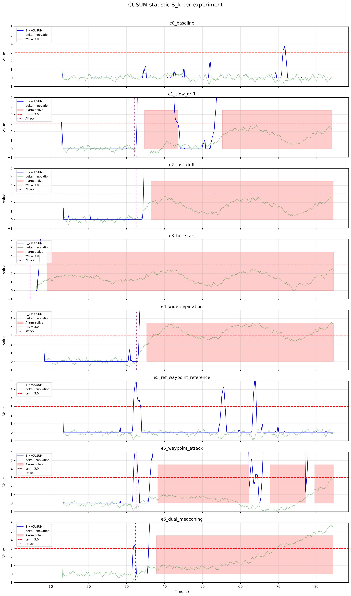
</p>

**Updated CUSUM statistic for all eight recorded scenarios.** E0 and E5 reference remain free of confirmed alarms. E1, E2, E3, E4, E5 and E6 produce confirmed detections with zero false alarms in this campaign. The confirmation window distinguishes persistent attack evidence from isolated transients.

### UWB distance (physical inter-robot distance)

| E0 | E1 | E2 | E3 | E4 |
|:---:|:---:|:---:|:---:|:---:|
| 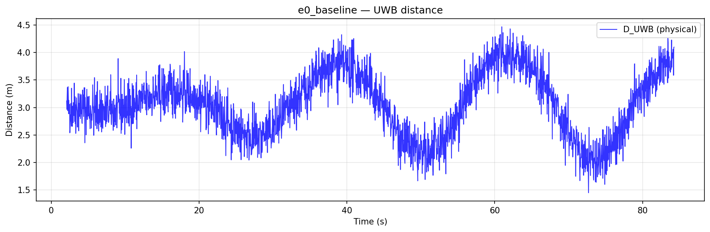 |  | 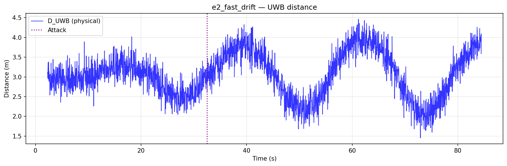 | 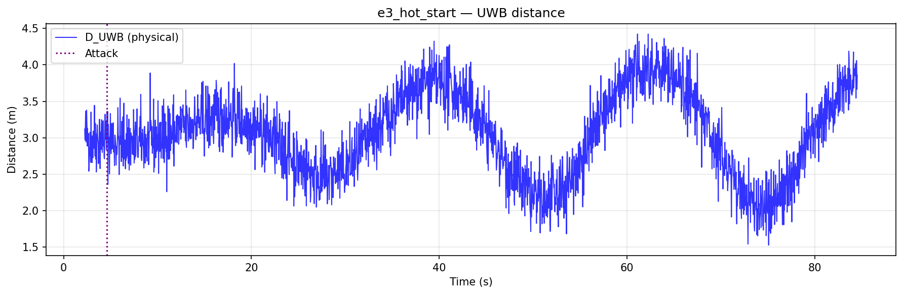 |  |

| E5 reference | E5 attack | E6 dual attack |
|:---:|:---:|:---:|
| 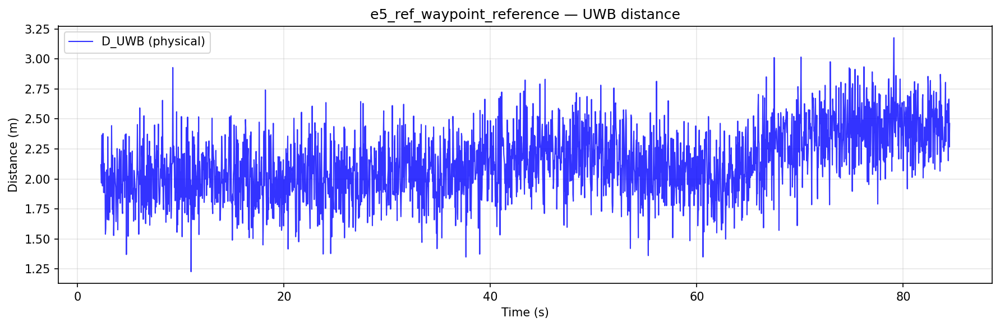 | 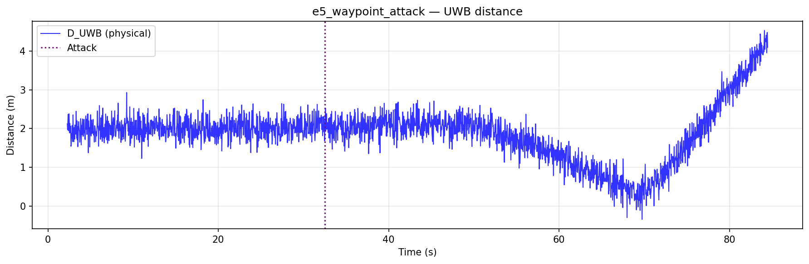 | 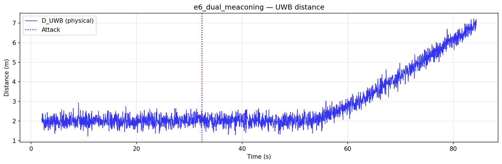 |

The UWB series remain independent of the GNSS injection in the sensor model. In E5 and E6, the physical distance also reflects the response of the waypoint controllers, so it must be interpreted together with the trajectories.

### Fixed threshold vs CUSUM

| E0 | E1 | E2 | E3 | E4 |
|:---:|:---:|:---:|:---:|:---:|
| 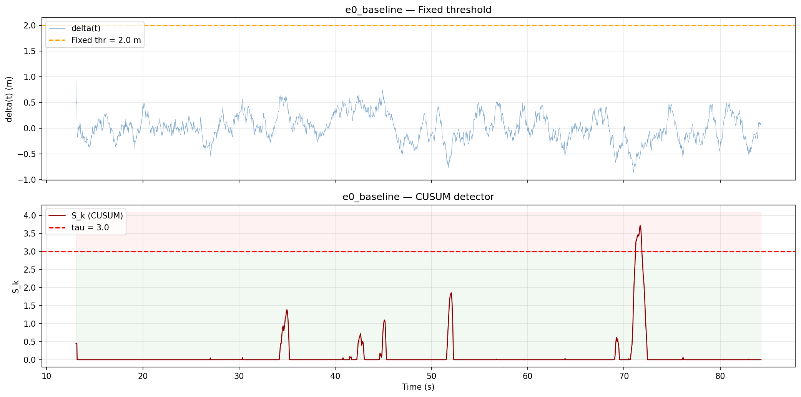 | 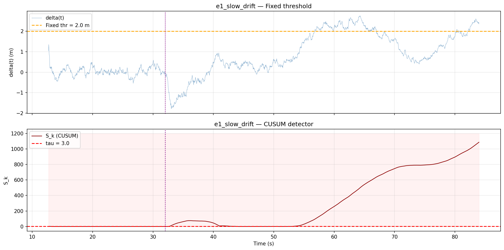 | 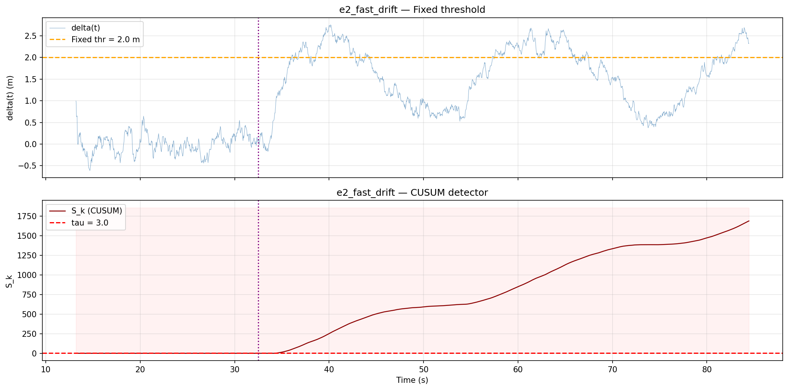 | 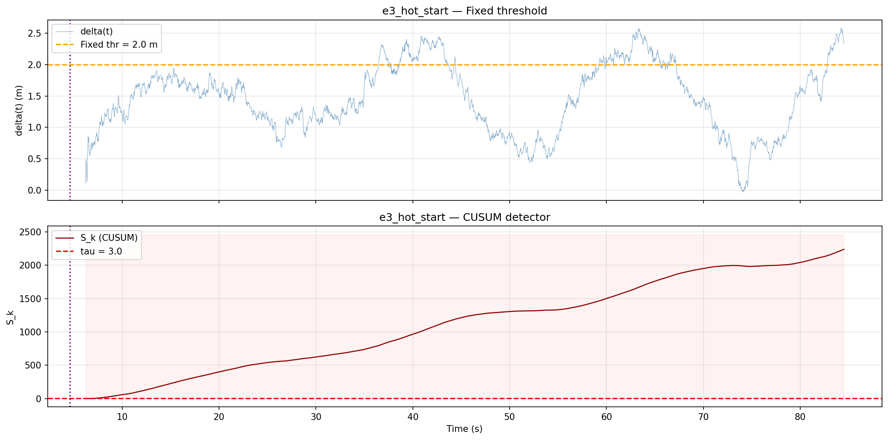 | 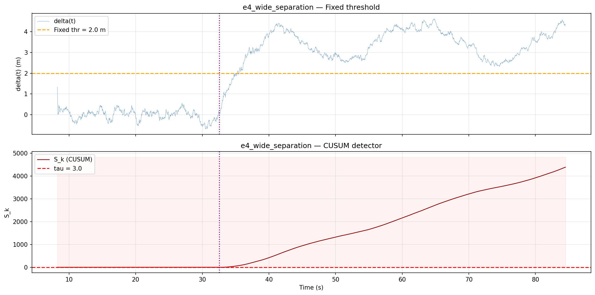 |

| E5 reference | E5 attack | E6 dual attack |
|:---:|:---:|:---:|
| 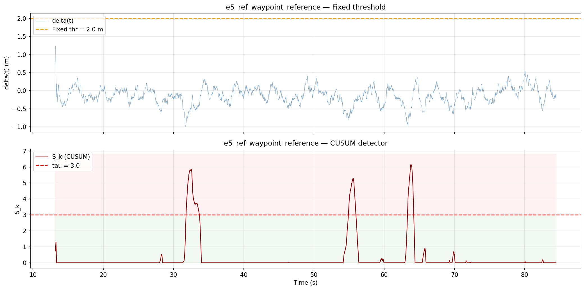 | 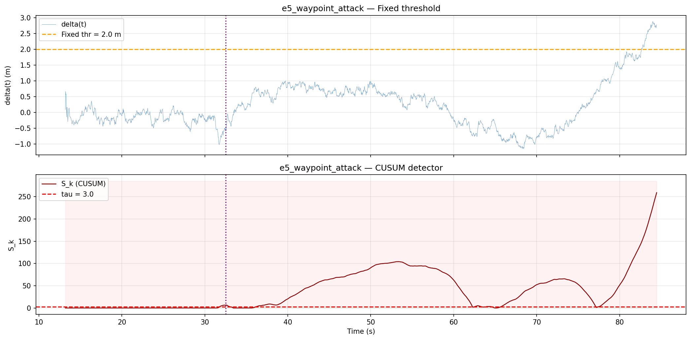 | 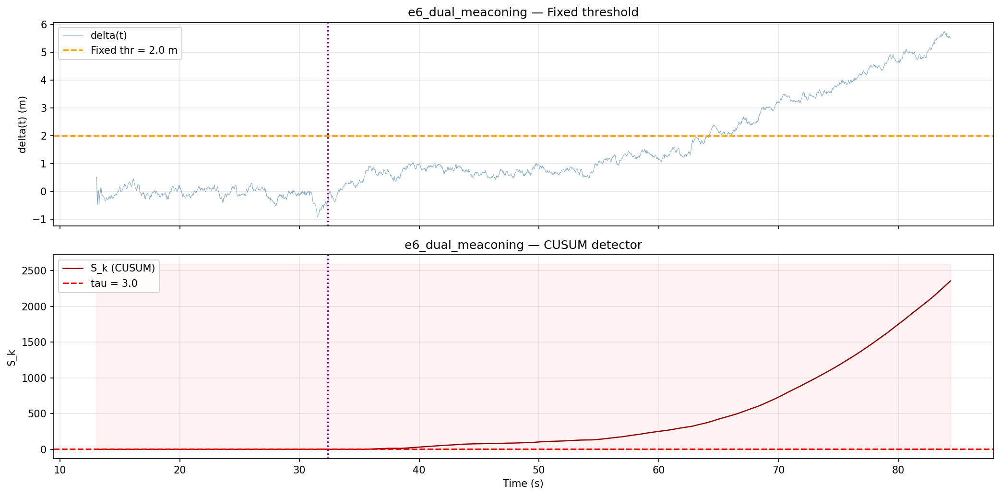 |

The fixed-threshold plots show why a single crossing is not enough: normal waypoint navigation can produce transient excursions, while the CUSUM plus a 2 s confirmation window rejects them and confirms persistent attack evidence. The innovation shown is the baseline-corrected, filtered value used by the detector.

### Physical drift and trajectories

E5 shows that R1 has only `0.091 m` of drift at detection but reaches `6.603 m` by the end of the run. E6 shows `0.218 m` of R1 drift at detection and final/max drifts of `7.032 m` for R1 and `8.979 m` for R2.

| E5 physical drift | E5 trajectories | E6 physical drift | E6 trajectories |
|:---:|:---:|:---:|:---:|
| 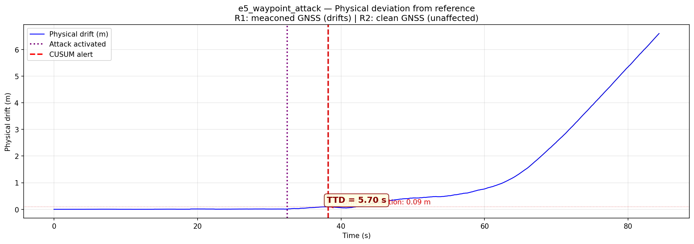 | 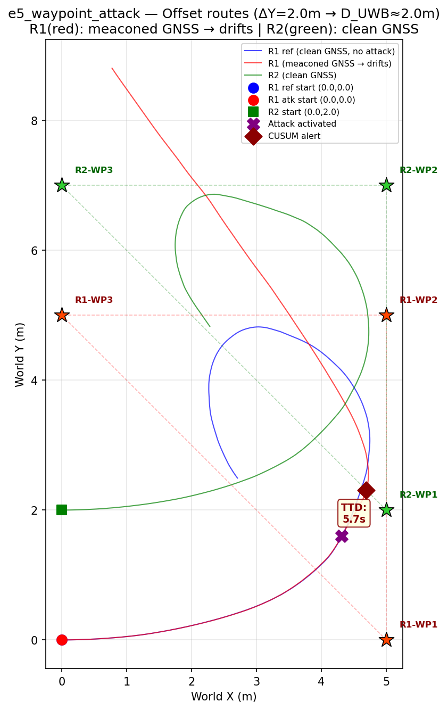 | 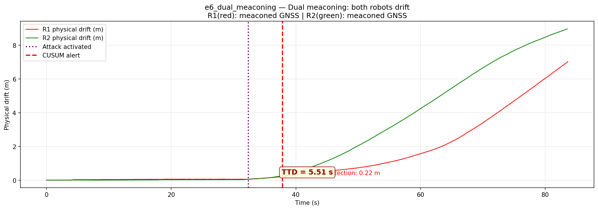 | 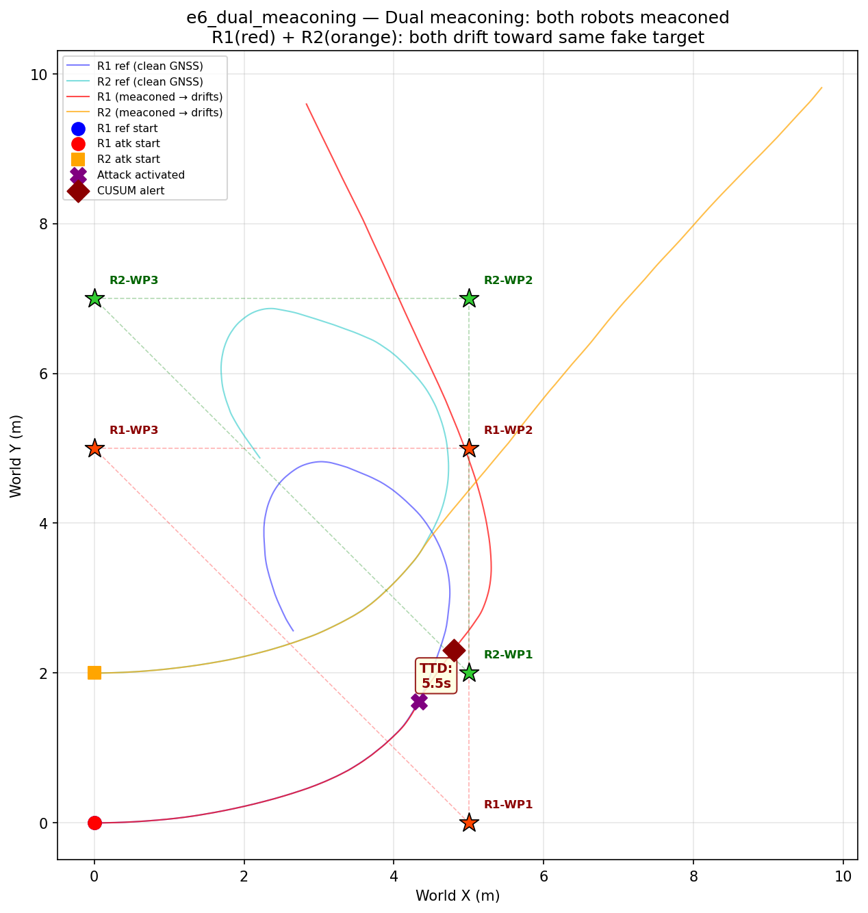 |

These plots connect statistical detection with physical impact. The attack is confirmed while the measured drift is still small, then the navigation error grows substantially if the attack is allowed to continue.

---

## Key Design Decisions

- **World-frame GNSS**: The DiffDrive plugin publishes odometry in a per-robot local frame starting at (0,0) regardless of world spawn position. The GNSS and UWB simulators add the known spawn offset to obtain world-frame coordinates, making $D_{GNSS}$ and $D_{UWB}$ directly comparable.

- **Per-robot Gazebo topics**: Each robot's SDF is dynamically patched at launch time to use model-specific transport topics (`/model/robot1/odom`, `/model/robot2/odom`, etc.), preventing the two bridges from receiving identical data from the shared global topics Gazebo uses by default.

- **Baseline-corrected signed CUSUM innovation**: The detector estimates the normal median of $D_{UWB} - D_{GNSS}$ during `startup_delay`, subtracts it, and feeds the corrected signed value to the two CUSUM tails. This prevents the Euclidean GNSS range bias from producing a false negative-tail alarm before activation, while preserving the positive meaconing signal.

- **Deterministic reproducibility**: A fixed `random_seed: 42` ensures identical noise sequences across runs, making experiments comparable.

---

## Troubleshooting

| Symptom | Likely cause | Fix |
|---|---|---|
| `ros_gz_sim not found` | Wrong ROS distro (Humble lacks `ros_gz_sim`) | Use `pixi run -e jazzy` |
| Robots not moving in Gazebo | Bridge topic mismatch | Ensure `two_robots.launch.py` uses per-robot SDF patching |
| UWB distance ≈ 0 | Both robots' odometry in local (0,0) frame | Check that GNSS/UWB nodes read `robot1.x`/`robot2.x` spawn offsets |
| CUSUM publishes nothing | Meaconing injector crashed | Check params for type errors (e.g. `9999` integer when float expected) |
| `colcon build` fails | Missing `resource/` marker | `touch src/collaborative_detection/resource/collaborative_detection` |
| Notebook shows no data | Ran outside ROS env | Launch Jupyter from `pixi run -e jazzy` |

---
